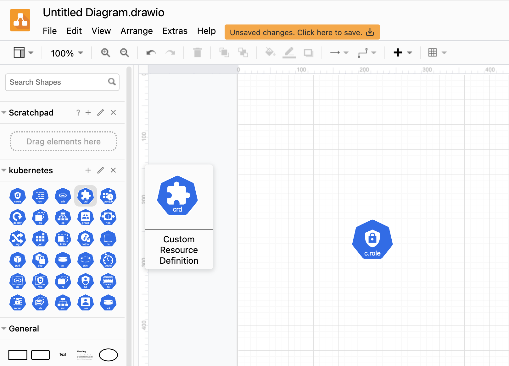

# Library with Kubernetes icons for draw.io
Since there are no icons available by default in draw.io for drawing Kubernetes infrastructure, we've bundled up the icons from the Kubernetes Community repository in a library.

[Click here to create a new diagram](https://app.diagrams.net/?splash=0&clibs=Uhttps%3A%2F%2Fraw.githubusercontent.com%2Fstrmprivacy%2Fdraw-io-library-kubernetes%2Fmaster%2FKubernetes.xml)

## Usage

1. Create a new draw.io diagram file
2. File
3. Open Library
4. Choose the [Kubernetes Icons](https://github.com/strmprivacy/draw-io-library-kubernetes/blob/master/kubernetes-icons.xml) file

## Attribution

All rights lie with their owners. Icons are directly downloaded from the [Kubernetes Community](https://github.com/kubernetes/community/tree/master/icons/svg/resources/labeled) repository.
